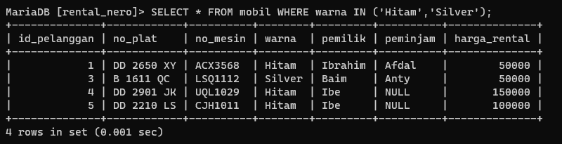

# Select Lanjutan
Setelah mempelajari select di materi sebelumnya sekarang kita akan masuk ke dalam materi select lanjutan, fungsi dari select select ini ialah untuk mendapatkan hasil yang lebih spesifik dan lebih luas, sekarang kita akan mempelajari 7 select lanjutan **(AND ,OR ,BETWEEN-AND ,NOT BETWEEN ,<= ,>= ,<> ATAU !=)** Untuk penjelasan lebih lanjutnya ialah seperti berikut :

> [!info]- Isi Table yang akan digunakan :
>>.png)
>

## AND
untuk **AND** ini akan mengambil "data 1" *dan* "data 2", contoh kodenya adalah seperti berikut :
```mysql
SELECT warna,pemilik FROM mobil WHERE warna="Hitam" AND pemilik="ibrahim";
```
Dan hasilnya akan seperti berikut :
.png)

## OR
Untuk **OR** ini akan mengambil "data 1" *atau* "data 2", contoh kodenya ialah seperti berikut :
```mysql
SELECT warna,pemilik FROM mobil WHERE warna="Hitam" OR pemilik="ibrahim";
```
Dan hasilnya akan seperti berikut :
.png)

## BETWEEN-AND
Untuk **BETWEEN-AND** ini akan mengambil antara "data 1" *sampai* "data 2" dibantu dengan **AND**, contoh kodenya ialah seperti berikut :
```mysql
SELECT * FROM mobil WHERE harga_rental BETWEEN 100000 AND 200000;
```
Dan hasilnya akan seperti berikut :
.png)

## NOT BETWEEN 
Untuk **NOT BETWEEN** ini akan mengambil "data" yang *bukan antara* "data 1" *dan* "data 2", contoh kodenya ialah seperti berikut :
```mysql
MariaDB [rental_nero]> SELECT * FROM mobil WHERE harga_rental NOT BETWEEN 100000 AND 200000;
```
Dan hasilnya akan seperti berikut :
.png)


## <=
Untuk **<=** ini akan mengambil "data"  lebih kecil atau sama dengan "nilai data", contoh kodenya ialah seperti berikut :
```mysql
MariaDB [rental_nero]> SELECT * FROM mobil WHERE harga_rental <= 50000;
```
Dan hasilnya akan seperti berikut :
.png)


## >=
Untuk **>=** ini akan mengambil "data"  lebih besar atau sama dengan "nilai data", contoh kodenya ialah seperti berikut :
```mysql
MariaDB [rental_nero]> SELECT * FROM mobil WHERE harga_rental >= 50000;
```
Dan hasilnya akan seperti berikut :
.png)


## <> atau !=
Untuk **<> atau !=** ini akan mengambil "data"  yang tidak sama dengan "nilai data", contoh kodenya ialah seperti berikut :
```mysql
MariaDB [rental_nero]> SELECT * FROM mobil WHERE harga_rental <> 50000;
```
Dan hasilnya akan seperti berikut :
.png)


## Tantangan I

Untuk tantangan saya akan mengambil nama pemilik "Ibe" dengan cara memanggilnya dengan syarat nomor pelatnya yaitu "DD 2901 JK" lalu hasilnya akan seperti berikut :
.png)

> [!info]- Analisis
>> "AND" : Mengambil data 1 **dan** data 2.
>> "OR" : Mengambil data antara data 1 **atau** data 2.
>> "BETWEEN-AND" : Mengambil data **antara** data 1 **sampai** data 2.
>> "NOT BETWEEN" : Mengambil data yang tidak  **antara** data 1 **sampai** data 2.
>> "<=" : Mengambil data yang lebih kecil atau sama dengan nilai data.
>> ">=" : Mengambil data yang lebih besar atau sama dengan nilai data.
>> "<> atau !=" : Mengambil data yang **tidak** sama dengan nilai data.


Kesimpulan : 
Select ini memiliki cakupan yang luas dan bervariasi semunya juga memiliki kelebihan dan keunikan masing masing sehingga dapat menampilkan hasil sebuah nilai yang di inginkan, keberagaman select ini mulai dari AND ,OR ,BETWEEN-AND ,NOT BETWEEN ,<= ,>= ,<> ATAU !=.  


**Pertemuan 5**
## IN 
Untuk select lanjutan berikutnya ialah IN yang berfungsi untuk menampilkan data yang di sebutkan pada dalam kurung yang diminta oleh IN, contoh kodenya akan seperti dibawah ini :
```mysql
select * from mobil WHERE warna IN ('Hitam','Silver');
```
Dan hasilnya akan seperti berikut :

> [!info]- Analisis:
>- **SELECT** adalah sebuah perintah query yang tugas memilih.
>- **FROM** adalah sebuah perintah query yang tugas nya untuk pemanggilan dari.
>- **WHERE** adalah sebuah perintah query yang tugas untuk menentukan pemanggilan yang mana ditujukannya.
>- **DATA_MOBIL** adalah sebuah nama tabel.
>- **WARNA** adalah sebuah nama kolom.
>- **SILVER DAN MERAH** adalah nama data pada sebuah kolom.
>- **IN** adalah perintah query yang betugas menentukan seluruh data yang sesuai dengan kondisi ditentukan, menghindari penulisan berulang query dengan kondisi yang sama.

**Kesimpulan :**
query diatas adalah perintah untuk menampilkan sebuah data dari tabel  data mobil yang bertujukan pada kolom *warna* dengan data yang hanya **silver dan merah**  jadi hanya data silver dan merah yang akan ditampilkan (tanpa menggunaka query dengan kondisi yang sama).

## IN+AND
Setelah mempelajari materi AND kita bisa menggabungkan IN dan AND untuk mendapat hasil yang lebih luas karna akan memiliki dua kondisi, untuk contoh kode programnnya akan seperti dibawah ini :
```mysql
Select * from mobil 
Where warna IN ("Hitam","Silver")
And harga_rental = 50000;
```
Dan hasilnya akan seperti berikut :


> [!info]- Analisis:
>**SELECT** adalah sebuah perintah query yang tugas memilih.
>- **FROM** adalah sebuah perintah query yang tugas nya untuk pemanggilan dari.
>- **WHERE** adalah sebuah perintah query yang tugas untuk menentukan pemanggilan yang mana ditujukannya.
>- **DATA_MOBIL** adalah sebuah nama tabel.
>- **WARNA** adalah sebuah nama kolom.
>- **HITAM DAN SILVER** adalah nama data pada sebuah kolom.
>- **IN** adalah perintah query yang betugas menentukan seluruh data yang sesuai dengan kondisi ditentukan, menghindari penulisan berulang query dengan kondisi yang sama.
>- **AND** adalah sebuah perintah query DAN menujukkan bahwa pemilihan data nya lebih dari 1
>- **HARGA_RENTAL** adalah sebuah nama kolom.
>6- **50000** adalah nama data pada sebuah kolom

**Kesimpulan :**
Query ini akan menampilkan data dimana mobil tersebut berwarna "Hitam","Silver" dan memiliki harga_rental = "50000", Seperti pada contoh di atas.

## IN+OR
Selanjutnya kita akan mempelajari query IN+OR untuk contoh kodenya akan seperti berikut :
```mysql
Select * from mobil 
Where warna IN ("Hitam","Silver")
or harga_rental = 50000;
```
Dan hasilnya akan seperti berikut :


> [!info]- Analisis:
>**SELECT** adalah sebuah perintah query yang tugas memilih.
>- **FROM** adalah sebuah perintah query yang tugas nya untuk pemanggilan dari.
>- **WHERE** adalah sebuah perintah query yang tugas untuk menentukan pemanggilan yang mana ditujukannya.
>- **DATA_MOBIL** adalah sebuah nama tabel.
>- **HARGA_RENTAL** adalah sebuah nama kolom.
>- **50000** adalah nama data pada sebuah kolom
>- **WARNA** adalah sebuah nama kolom.
>- **HITAM DAN SILVER** adalah nama data pada sebuah kolom.
>- **IN** adalah perintah query yang betugas menentukan seluruh data yang sesuai dengan kondisi ditentukan, menghindari penulisan berulang query dengan kondisi yang sama.
>- **OR** adalah perintah yang bertugas menentukan data dengan format "atau".

**Kesimpulan :**
Query ini akan mengambil data mobil yang berwarna "Hitam","Silver" atau yang memiliki harga rental = 50000.

## IN + AND + OPERATOR
Selanjutnya kita akan menggabungkan antara IN, AND dan Operator. untuk kode program nya akan terlihat seperti berikut :
```mysql
Select * from mobil 
Where warna IN ("Hitam","Silver")
or harga_rental > 50000;
```
Dan hasilnya akan seperti berikut :


> [!info]- Analisis:
>**SELECT** adalah sebuah perintah query yang tugas memilih.
>- **FROM** adalah sebuah perintah query yang tugas nya untuk pemanggilan dari.
>- **WHERE** adalah sebuah perintah query yang tugas untuk menentukan pemanggilan yang mana ditujukannya.
>- **DATA_MOBIL** adalah sebuah nama tabel.
>- **WARNA** adalah sebuah nama kolom.
>- **HITAM DAN SILVER** adalah nama data pada sebuah kolom.
>- **IN** adalah perintah query yang betugas menentukan seluruh data yang sesuai dengan kondisi ditentukan, menghindari penulisan berulang query dengan kondisi yang sama.
>- **AND** adalah sebuah perintah query DAN menujukkan bahwa pemilihan data nya lebih dari 1
>- **HARGA_RENTAL** adalah sebuah nama kolom.
>- **50000** adalah nama data pada sebuah kolom
>`>` ialah sebuah operator yang bertugas untuk mengambil data khusus "di atas" 50000.

**Kesimpulan :**
Jadi query ini akan mengambil data dengan warna "Hitam","Silver" dan mobil dengan harga rental di atas 50000.


## LIKE 

1. MENCARI AWALAN
**Struktur** :
```MYSQL 
 select * from nama_tabel
    -> where nama_kolom like 'nama_pola';
```
**Contoh** :
```MYSQL
 select * from data_mobil
    -> where pemilik like 'ib%';
```
**Hasil** :

**Analisis** :
 - **SELECT** adalah sebuah perintah query yang tugas memilih.
- **FROM** adalah sebuah perintah query yang tugas nya untuk pemanggilan dari.
- **WHERE** adalah sebuah perintah query yang tugas untuk menentukan pemanggilan yang mana ditujukannya.
- **DATA_MOBIL** adalah sebuah nama tabel.
- **PEMILIK** adalah sebuah nama kolom.
- **LIKE** adalah perintah query yang betugas menentukan hasil berdasarkan pola teks tertentu.
- **IB%** adalah sebuah pola awalan tertentu yang ingin ditampilkan.

**Kesimpulan** :
query diatas adalah perintah untuk menampilkan data pada kolom pemilik yang berpola ib% artinya data dengan awalan ib pada kolom pemilik yang akan ditampilkan.

2.  MENCARI AKHIRAN 
**Struktur** :
```MYSQL 
 select * from nama_tabel
    -> where nama_kolom like 'nama_pola';
```
**Contoh** :
```MYSQL
 select * from data_mobil
    -> where pemilik like '%M';
```
**Hasil** :

**Analisis** :
 - **SELECT** adalah sebuah perintah query yang tugas memilih.
- **FROM** adalah sebuah perintah query yang tugas nya untuk pemanggilan dari.
- **WHERE** adalah sebuah perintah query yang tugas untuk menentukan pemanggilan yang mana ditujukannya.
- **DATA_MOBIL** adalah sebuah nama tabel.
- **PEMILIK** adalah sebuah nama kolom.
- **LIKE** adalah perintah query yang betugas menentukan hasil berdasarkan pola teks tertentu.
- **%M** adalah sebuah pola akhiran tertentu yang ingin ditampilkan.
**Kesimpulan** :
query diatas adalah perintah untuk menampilkan data pada kolom pemilik yang berpola %m artinya data dengan akhiran M pada kolom pemilik yang akan ditampilkan.

3. MENCARI AWALAN DAN AKHIRAN
**Struktur** :
```MYSQL 
 select * from nama_tabel
    -> where nama_kolom like 'nama_pola';
```
**Contoh** :
```MYSQL
 select * from data_mobil
    -> where pemilik like 'B%M';
```
**Hasil** :

**Analisis** : 
 - **SELECT** adalah sebuah perintah query yang tugas memilih.
- **FROM** adalah sebuah perintah query yang tugas nya untuk pemanggilan dari.
- **WHERE** adalah sebuah perintah query yang tugas untuk menentukan pemanggilan yang mana ditujukannya.
- **DATA_MOBIL** adalah sebuah nama tabel.
- **PEMILIK** adalah sebuah nama kolom.
- **LIKE** adalah perintah query yang betugas menentukan hasil berdasarkan pola teks tertentu.
- **B%M** adalah sebuah pola awalan dan akhiran tertentu yang ingin ditampilkan.
**Kesimpulan** :
query diatas adalah perintah untuk menampilkan data pada kolom pemilik yang berpola b%m artinya data dengan awalan B dan akhiran M pada kolom pemilik yang akan ditampilkan.

4. MENCARI BERDASARKAN TOTAL KARAKTER
**Struktur** :
```MYSQL
select * from nama_tabel
    -> where nama_kolom like 'nama_pola';
```
**Contoh** :
```MYSQL
select * from data_mobil
    -> where pemilik like 'i__';
```
**Hasil** :

**Analisis** :
 - **SELECT** adalah sebuah perintah query yang tugas memilih.
- **FROM** adalah sebuah perintah query yang tugas nya untuk pemanggilan dari.
- **WHERE** adalah sebuah perintah query yang tugas untuk menentukan pemanggilan yang mana ditujukannya.
- **DATA_MOBIL** adalah sebuah nama tabel.
- **PEMILIK** adalah sebuah nama kolom.
- **LIKE** adalah perintah query yang betugas menentukan hasil berdasarkan pola teks tertentu.
- **'I__'** adalah pola karakter tertentu yang ingin ditampilkan.
**Kesimpulan** :
query adalah perintah untuk menampilkan data pada kolom pemilik yang berawalan i dan memiliki 2 karakter yang lainnya(hanya menampilkan nama pemilik dengan 3 kata dan berawalan i).

5. KOMBINASI 
**Struktur** :
```MYSQL
SELECT * FROM NAMA_TABEL
-> WHERE NAMA_KOLOM LIKE 'NAMA_POLA';
```
**Contoh** :
```MYSQL
SELECT * FROM DATA_MOBIL
-> WHERE PEMILIK LIKE '__R%';
```
**Hasil** :

**Analisis** :
- **SELECT** adalah sebuah perintah query yang tugas memilih.
- **FROM** adalah sebuah perintah query yang tugas nya untuk pemanggilan dari.
- **WHERE** adalah sebuah perintah query yang tugas untuk menentukan pemanggilan yang mana ditujukannya.
- **DATA_MOBIL** adalah sebuah nama tabel.
- **PEMILIK** adalah sebuah nama kolom.
- **LIKE** adalah perintah query yang betugas menentukan hasil berdasarkan pola teks tertentu.
- **'__R%'** adalah pola karakter tertentu dari salah satu data yang ingin ditampilkan.
**Kesimpulan** :
query adalah perintah untuk menampilkan data pada kolom pemilik yang  huruf ketiganya adalah R  .

6. NOT LIKE
**Struktur** :
```MYSQL
SELECT * FROM NAMA_TABEL WHERE NAMA_KOLOM NOT LIKE 'NAMA_POLA'
```
**Contoh** :
```MYSQL
 SELECT * FROM DATA_MOBIL WHERE PEMINJAM NOT LIKE 'A%';
```
**Hasil** :

**Analisis** : 
 - **SELECT** adalah sebuah perintah query yang tugas memilih.
- **FROM** adalah sebuah perintah query yang tugas nya untuk pemanggilan dari.
- **WHERE** adalah sebuah perintah query yang tugas untuk menentukan pemanggilan yang mana ditujukannya.
- **DATA_MOBIL** adalah sebuah nama tabel.
- **PEMINJAM** adalah sebuah nama kolom.
- **NOT LIKE** adalah perintah query yang betugas menentukan hasil yang tidak sesuai berdasarkan pola teks tertentu.
- **'A%'** adalah pola yang tidak boleh ditampilkan.
**Kesimpulan** :
query adalah perintah untuk menampilkan data pada kolom peminjam yang tidak memiliki huruf A pada datanya.

## NULL & NOT NULL
1. MENCARI DATA KOSONG 
**Struktur** :
```MYSQL
 SELECT * FROM NAMA_TABEL WHERE NAMA_KOLOM IS NOT NULL;
```
**Contoh** :
```MYSQL
 SELECT * FROM DATA_MOBIL WHERE PEMINJAM IS NOT NULL;
```
**Hasil** :

**Analisis** :
 - **SELECT** adalah sebuah perintah query yang tugas memilih.
- **FROM** adalah sebuah perintah query yang tugas nya untuk pemanggilan dari.
- **WHERE** adalah sebuah perintah query yang tugas untuk menentukan pemanggilan yang mana ditujukannya.
- **DATA_MOBIL** adalah sebuah nama tabel.
- **PEMINJAM** adalah sebuah nama kolom.
- **IS  NULL** adalah perintah query yang betugas menampilkan suatu kolom yang  memiliki  data.
**Kesimpulan** :
query adalah perintah untuk menampilkan tabel yang pada kolom peminjamnya tidak memiliki data atau NULL.

2. NOT NULL 
**Struktur** :
```MYSQL
 SELECT * FROM NAMA_TABEL WHERE NAMA_KOLOM IS NOT NULL;
```
**Contoh** :
```MYSQL
 SELECT * FROM DATA_MOBIL WHERE PEMINJAM IS NOT NULL;
```
**Hasil** :

**Analisis** :
 - **SELECT** adalah sebuah perintah query yang tugas memilih.
- **FROM** adalah sebuah perintah query yang tugas nya untuk pemanggilan dari.
- **WHERE** adalah sebuah perintah query yang tugas untuk menentukan pemanggilan yang mana ditujukannya.
- **DATA_MOBIL** adalah sebuah nama tabel.
- **PEMINJAM** adalah sebuah nama kolom.
- **IS NOT NULL** adalah perintah query yang betugas menampilkan suatu kolom yang  memiliki nilai .
**Kesimpulan** :
query adalah perintah untuk menampilkan tabel yang pada kolom peminjamnya 
terdapat sebuah data atau NOT NULL.

## ORDER BY LIMIT

1. ASC
**Struktur** :
```MYSQL
SELECT * FROM NAMA_TABEL ORDER BY NAMA_KOLOM ASC;
```
**Contoh** :
```MYSQL
 SELECT * FROM DATA_MOBIL ORDER BY PEMILIK ASC;
```
**Hasil** :

**Analisis** :
 - **SELECT** adalah sebuah perintah query yang tugas memilih.
- **FROM** adalah sebuah perintah query yang tugas nya untuk pemanggilan dari.
- **ORDER BY** adalah sebuah perintah query yang  untuk mengurutkan pemanggilan berdasarkan nilai.
- **DATA_MOBIL** adalah sebuah nama tabel.
- **PEMINJAM** adalah sebuah nama kolom.
- **ASC** adalah perintah query yang betugas menampilkan suatu data secara berurutan ke atas.
**Kesimpulan** :
query adalah perintah untuk menampilkan tabel dengan data pada kolom peminjam sesuai dengan alfabet dari A-Z.

2. DESC
**Struktur** :
```MYSQL
SELECT * FROM NAMA_TABEL ORDER BY NAMA_KOLOM DESC;
```
**Contoh** :
```MYSQL
 SELECT * FROM DATA_MOBIL ORDER BY PEMILIK DESC;
```
**Hasil** :

**Analisis** :
 - **SELECT** adalah sebuah perintah query yang tugas memilih.
- **FROM** adalah sebuah perintah query yang tugas nya untuk pemanggilan dari.
- **ORDER BY** adalah sebuah perintah query yang  untuk mengurutkan pemanggilan berdasarkan nilai.
- **DATA_MOBIL** adalah sebuah nama tabel.
- **PEMINJAM** adalah sebuah nama kolom.
- **DESC** adalah perintah query yang betugas menampilkan suatu data secara berurutan ke bawah .
**Kesimpulan** :
query di atas adalah perintah untuk menampilkan tabel dengan data pada kolom peminjam sesuai dengan alfabet dari Z-A.

3. LIMIT 
**Struktur** :
```MYSQL
SELECT * FROM NAMA_TABEL ORDER BY NAMA_KOLOM ASC;
```
**Contoh** :
```MYSQL
 SELECT * FROM DATA_MOBIL ORDER BY PEMILIK ASC;
```
**Hasil** :

**Analisis** :
 - **SELECT** adalah sebuah perintah query yang tugas memilih.
- **FROM** adalah sebuah perintah query yang tugas nya untuk pemanggilan dari.
- **ORDER BY** adalah sebuah perintah query yang  untuk mengurutkan pemanggilan berdasarkan nilai.
- **DATA_MOBIL** adalah sebuah nama tabel.
- **PEMINJAM** adalah sebuah nama kolom.
- **ASC** adalah perintah query yang betugas menampilkan suatu data secara berurutan ke atas.
KESIMPULAN:
query adalah perintah untuk menampilkan tabel dengan data pada kolom peminjam sesuai dengan alfabet dari A-Z.

3. LIMIT 
**Struktur** :
```MYSQL
SELECT * FROM NAMA_TABEL WHERE NAMA_KOLOM="NAMA_DATA" ORDER BY NAMA_KOLOM ASC LIMIT 2;
```

**Contoh** :
```MYSQL
SELECT * FROM DATA_MOBIL WHERE WARNA="HITAM" ORDER BY HARGA_RENTAL ASC LIMIT 2;
```

**Hasil** :

**Analisis** :
 - **SELECT** adalah sebuah perintah query yang tugas memilih.
- **FROM** adalah sebuah perintah query yang tugas nya untuk pemanggilan dari.
- **ORDER BY** adalah sebuah perintah query yang  untuk mengurutkan pemanggilan berdasarkan nilai.
- **DATA_MOBIL** adalah sebuah nama tabel.
- **WHERE** adalah sebuah perintah query yang tugas untuk menentukan pemanggilan yang mana ditujukannya.
- **PEMINJAM & WARNA** adalah sebuah nama kolom.
- **ASC** adalah perintah query yang betugas menampilkan suatu data secara berurutan ke atas.
- **HITAM** adalah nama data pada sebuah kolom.
- **LIMIT 2** adalah perintah untuk membatasi jumlah baris yang ingin ditampilkan.

**Kesimpulan** :
Query di atas adalah perintah untuk menampilkan tabel dengan data hitam pada kolom warna yang sesuai dengan alfabet A-Z  tapi ditampilkan hanya 2 baris .

## DISTINCT 

**Struktur** :
```MYSQL 
SELECT DISTINCT(NAMA_KOLOM) FROM NAMA_TABEL;
```

**Contoh** :
```MYSQL
SELECT DISTINCT(PEMILIK) FROM DATA_MOBIL;
```

**Hasil** :


**Analisis** :
- **SELECT** adalah perintah query yang tugas nya memilih.
- **DISTINCT** adalah perintah untuk mengembalikan nilai unik dari hasil query.
- **PEMILIK** adalah sebuah nama kolom.
- **FROM** adalah sebuah pemanggilan dari data yang ditujukan.
- **DATA_MOBIL** adalah sebuah nama tabel.

**Kesimpulan** :
query di atas perintah ini akan mengembalikan setiap nilai yang berbeda dari kolom "PEMILIK", tanpa adanya duplikasi. Ini berguna untuk melihat daftar pemilik mobil yang berbeda yang terdapat dalam tabel tersebut.

## CONCAT,CONCAT_WS,AS

1. CONCAT
**Struktur** :
```MYSQL
SELECT CONCAT(NAMA_TABEL,NAMA_KOLOM) FROM NAMA_TABEL;
```

**Contoh** :
```MYSQL
SELECT CONCAT(PEMILIK,WARNA) FROM DATA_MOBIL;
```

**Hasil** :
![[Aset/IMG6/IMG6_8.png]]
**Analisis** :
- **SELECT** adalah perintah query yang tugas nya memilih.
- **CONCAT** adalah perintah untuk menggabungkan sebuah kolom untuk ditampilkan.
- **PEMILIK & WARNA** adalah sebuah nama kolom.
- **FROM** adalah sebuah pemanggilan dari data yang ditujukan.
- **DATA_MOBIL** adalah sebuah nama tabel.
KESIMPULAN:
query di atas adalah perintah untuk menggabungkan kolom pemilik dan warna untuk ditampilkan

2. CONCAT_WS
**Struktur** :
```MYSQL
SELECT CONCAT_WS ("PEMISAH",NAMA_KOLOM,NAMA_KOLOM,NAMA_KOLOM) FROM NAMA_TABEL;
```

**Contoh** :
```MYSQL
SELECT CONCAT_WS ("-",NO_PLAT,NO_MESIN,ID_MOBIL) FROM DATA_MOBIL;
```

**Hasil** :

**Analisis** :
- **SELECT** adalah perintah query yang tugas nya memilih.
- **CONCAT_WS** adalah perintah untuk menggabungkan nilai nilai sebuah kolom dan memiliki pemisah tertentu untuk ditampilkan.
- **NO_PLAT,NO_MESIN,ID_MOBIL** adalah sebuah nama kolom.
- **"-"** adalah pemisah dari kolom yang di satukan.
- **FROM** adalah sebuah pemanggilan dari data yang ditujukan.
- **DATA_MOBIL** adalah sebuah nama tabel.
**Kesimpulan** : 
query di atas adalah perintah untuk menggabungkan kolom no_plat,no_mesin,id_mobil menggunakan "-" sebagai pemisah untuk ditampilkan.

3. AS
**Struktur** :
```MYSQL
SELECT CONCAT_WS ("PENGHUBUNG",NAMA_KOLOM,NAMA_KOLOM) FROM NAMA_TABEL;
```

**Contoh** :
```MYSQL
SELECT CONCAT_WS ("+",PEMILIK,PEMINJAM) FROM DATA_MOBIL;
```

**Hasil** : 

**Analisis** :
- **SELECT** adalah perintah query yang tugas nya memilih.
- **CONCAT_WS** adalah perintah untuk menggabungkan nilai nilai sebuah kolom dan memiliki pemisah tertentu untuk ditampilkan.
- **PEMILIK,PEMINJAM** adalah sebuah nama kolom.
- **"+"** adalah penghubung dari kolom yang di satukan.
- **FROM** adalah sebuah pemanggilan dari data yang ditujukan.
- **DATA_MOBIL** adalah sebuah nama tabel.
**Kesimpulan** :  
query di atas adalah perintah untuk menggabungkan kolom pemilik dan peminjam menggunakan "+" sebagai penghubung untuk ditampilkan.

## VIEW
1. MEMBUAT TABEL VIRTUAL
**Struktur** :
```MYSQL
CREATE VIEW NAMA_TABEL_VIRTUAL AS
SELECT NAMA_KOLOM,NAMA_KOLOM,NAMA_KOLOM,NAMA_KOLOM
FROM NAMA_TABEL
WHERE NAMA_KOLOM="NAMA_DATA";
```

**Contoh** :
```MYSQL
CREATE VIEW INFO_NO_PLAT AS
SELECT ID_PELANGGAN,NO_PLAT,PEMILIK,PEMINJAM
FROM DAFTAR_MOBIL
WHERE PEMILIK="IBRAHIM";
```

**Hasil** :

**Analisis** :
- **SELECT** adalah perintah query yang tugas nya memilih.
- **CREATE VIEW** adalah perintah untuk membuat sebuah tabel virtual
- **ID_MOBIL,NO_PLAT,PEMILIK,PEMINJAM** adalah sebuah nama kolom.
- **FROM** adalah sebuah pemanggilan dari data yang ditujukan.
- **DATA_MOBIL** adalah sebuah nama tabel.
- **WHERE** adalah sebuah perintah query yang tugas untuk menentukan pemanggilan yang mana ditujukannya.
- **IBRAHIM** adalah nama data pada suatu kolom
**Kesimpulan** :
query diatas adalah perintah untuk membuat sebuah tabel virtual yang ditampilkan adalah kolom id_mobil,no_plat,pemilik,peminjam yang sesuai dengan data ibrahim pada kolom pemilik.

2. MENAMPILKAN TABEL VIRTUAL 
**Struktur** :
```MYSQL
SELECT * FROM NAMA_TABEL_VITUAL;
```

**Contoh** :
```MYSQL
SELECT * FROM INFO_NO_PLAT;
```

**Hasil** :

**Analisis** :
- **SELECT** adalah perintah query yang tugas nya memilih.
- **FROM** adalah perintah query dari.
- **INFO_NO_PLAT** adalah sebuah nama tabel virtual yang telah dibuat
**Kesimpulan** :
query di atas adalah perintah untuk menampilkan tabel virtual yang dibuat tadi.

3. MENGHAPUS TABEL VIRTUAL 
**Struktur** :
```MYSQL
DROP VIEW NAMA_TABEL_VITUAL;
```

**Contoh** :
```MYSQL
DROP VIEW INFO_NO_PLAT;
```

**Hasil** :

**Analisis** :
	query di atas adalah perintah untuk menghapus tabel yang telah dibuat tadi.

## AGREGASI 
1. MENGHITUNG TOTAL
**Struktur** :
```MYSQL
SELECT SUM(NAMA_KOLOM) AS NAMA_KOLOM FROM NAMA_TABEL
```
**Contoh** :
```MYSQL
SELECT SUM(HARGA_RENTAL) AS TOTAL_HARGA FROM DAFTAR_MOBIL;
```
**Hasil** :

**Analisis** :
- **SELECT** adalah perintah untuk memilih suatu kolom 
- **SUM** adalah perintah untuk menghitung semua total jumlah
- **HARGA_RENTAL** adalah sebuah nama kolom
- **AS** adalah perintah untuk memberikan nama lain dari perintah tersebut.
- **TOTAL_HARGA** nama lain dari kolom pada perintah tersebut
- **DATA_MOBIL** adalah sebuah nama tabel.
**Kesimpulan** :
query di atas adalah perintah untuk menghitung total data dari kolom harga rental dan diubah nama nya menjadi total harga

2. MENGHITUNG JUMLAH BARIS
**Struktur** :
```MYSQL
SELECT COUNT(NAMA_KOLOM) AS NAMA_KOLOM FROM NAMA_TABEL
```
**Contoh** :
```MYSQL
SELECT COUNT(PEMILIK) AS JUMLAH_PEMILIK FROM DATA_MOBIL;
```
**Hasil** :

**Analisis** :
- **SELECT** adalah perintah untuk memilih suatu kolom 
- **COUNT** adalah perintah untuk menghitung semua jumlah baris.
- **JUMLAH_PEMILIK** adalah sebuah nama kolom
- **AS** adalah perintah untuk memberikan nama lain dari perintah tersebut.
- **PEMILIK** nama lain dari kolom pada perintah tersebut
- **DATA_MOBIL** adalah sebuah nama tabel.
**Kesimpulan** :
query di atas adalah perintah untuk menghitung jumlah data pada kolom pemilik.

3. MENGHITUNG NILAI TERENDAH
**Struktur** :
```MYSQL
SELECT MIN(NAMA_KOLOM) AS NAMA_KOLOM FROM NAMA_TABEL
```
**Contoh** :
```MYSQL
SELECT MIN(HARGA_RENTAL) AS MINIMUM FROM DATA_MOBIL;
```
**Hasil** :

**Analisis** :
- **SELECT** adalah perintah untuk memilih suatu kolom 
- **MIN** adalah perintah untuk menghitung jumlah data yang paling terkecil.
- **HARGA_RENTAL** adalah sebuah nama kolom
- **AS** adalah perintah untuk memberikan nama lain dari perintah tersebut.
- **MINIMUM** nama lain dari kolom pada perintah tersebut
- **DATA_MOBIL** adalah sebuah nama tabel.
**Kesimpulan** :
query di atas adalah perintah untuk menghitung jumlah data  terkecil dari kolom harga rental dan ditampilkan dengan kolom baru yaitu MINIMUM.

4. MENGHITUNG NILAI TERTINGGI 
**Struktur** :
```MYSQL
SELECT MAX(NAMA_KOLOM) AS NAMA_KOLOM FROM NAMA_TABEL
```
**Contoh** :
```MYSQL
SELECT MAX(HARGA_RENTAL) AS MAXIMUM FROM DATA_MOBIL;
```
**Hasil** :

**Analisis** :
- **SELECT** adalah perintah untuk memilih suatu kolom 
- **MAX** adalah perintah untuk menghitung data yang paling tinggi.
- **HARGA_RENTAL** adalah sebuah nama kolom
- **AS** adalah perintah untuk memberikan nama lain dari perintah tersebut.
- **MAXIMUM** nama lain dari kolom pada perintah tersebut
- **DATA_MOBIL** adalah sebuah nama tabel.
**Kesimpulan** :
query di atas adalah perintah untuk menghitung jumlah data tertinggi dari kolom harga rental dan ditampilkan dengan kolom baru yaitu MAXIMUM.

5. MENAMPILKAN NILAI RATA RATA
**Struktur** :
```MYSQL
SELECT AVG(NAMA_KOLOM) AS NAMA_KOLOM FROM NAMA_TABEL
```
**Contoh** :
```MYSQL
SELECT AVG(HARGA_RENTAL) AS RERATA FROM DATA_MOBIL;
```
**Hasil** :

**Analisis** :
- **SELECT** adalah perintah untuk memilih suatu kolom 
- **AVG** adalah perintah untuk menghitung jumlah rata rata
- **HARGA_RENTAL** adalah sebuah nama kolom
- **AS** adalah perintah untuk memberikan nama lain dari perintah tersebut.
- **RERATA** nama lain dari kolom pada perintah tersebut
- **DATA_MOBIL** adalah sebuah nama tabel.
**Kesimpulan** :
query di atas adalah perintah untuk menghitung rata rata jumlah data dari kolom harga rental dan ditampilkan dengan kolom baru yaitu RERATA.

