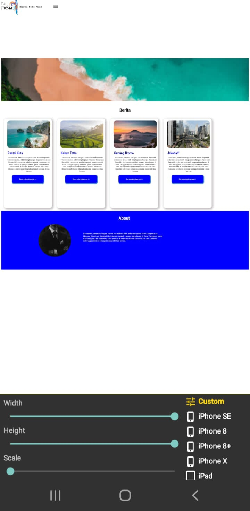

```html
<!DOCTYPE html>

<html>

<head>
    <link rel="stylesheet" href="pesonaindonesiaa.css">
    <title>Pesona Indonesia</title>
</head>
<body>
   <div class="container">
        
        <div class="kotak">
                
                    <div class="tulisan">
                        <h4 class="teksnavbar">&nbsp;&nbsp;&nbsp;&nbsp;Beranda&nbsp;&nbsp;&nbsp;Berita&nbsp;&nbsp;&nbsp;About&nbsp;&nbsp;&nbsp;&nbsp;</h4>
                        
                    </div>
        </div>

        <div class="box1">
            <h1 class="tek1ws2">Selamat Datang di Indonesia!</h1>
             <p class="teks3">Inilah webite yang berisi Keindahan Alam Indonesia.<br>Selamat menikmati Keindahan Indonesia teman-teman :D</p>
             <button class="tombol2">Klik disini!</button>
        </div>

        <div class="box2">
            <h1 class="judul" align="center">Berita</h1>
              <div class="berita">
                    
                    <h2 class="tk">Pantai Kuta</h2> <br>
                    <p class="teks33">Indonesia, dikenal dengan nama resmi Republik Indonesia 
                        atau lebih lengkapnya Negara Kesatuan Republik Indonesia,
                        adalah negara kepulauan di Asia Tenggara yang dilintasi garis khatulistiwa
                        dan berada di antara daratan benua Asia
                        dan Oseania sehingga dikenal sebagai negara lintas benua.</p>
                    <button class="tombol1">Baca selengkapnya >></button>
              </div>

              <div class="berita">
                    
                    <h2 class="tk">Kebun Tetta</h2> <br>
                    <p class="teks33">Indonesia, dikenal dengan nama resmi Republik Indonesia 
                        atau lebih lengkapnya Negara Kesatuan Republik Indonesia,
                        adalah negara kepulauan di Asia Tenggara yang dilintasi garis khatulistiwa
                        dan berada di antara daratan benua Asia
                        dan Oseania sehingga dikenal sebagai negara lintas benua.</p>
                    <button class="tombol1">Baca selengkapnya >></button>
              </div>

              <div class="berita">
                
                <h2 class="tk">Gunung Bromo</h2> <br>
                <p class="teks33">Indonesia, dikenal dengan nama resmi Republik Indonesia 
                    atau lebih lengkapnya Negara Kesatuan Republik Indonesia,
                    adalah negara kepulauan di Asia Tenggara yang dilintasi garis khatulistiwa
                    dan berada di antara daratan benua Asia
                    dan Oseania sehingga dikenal sebagai negara lintas benua.</p>
                <button class="tombol1">Baca selengkapnya >></button>
              </div>

              <div class="berita">
                
                <h2 class="tk">Jekadah!</h2> <br>
                <p class="teks33">Indonesia, dikenal dengan nama resmi Republik Indonesia 
                    atau lebih lengkapnya Negara Kesatuan Republik Indonesia,
                    adalah negara kepulauan di Asia Tenggara yang dilintasi garis khatulistiwa
                    dan berada di antara daratan benua Asia
                    dan Oseania sehingga dikenal sebagai negara lintas benua.</p>
                <button class="tombol1">Baca selengkapnya >></button>
              </div>
        </div>

       

        <div class="box3">
        <h1 class="about">About</h1>
        <div class="teks4">
                
                <p class="teks5">Indonesia, dikenal dengan nama resmi Republik Indonesia
                    atau lebih lengkapnya <br> Negara Kesatuan Republik Indonesia,
                    adalah negara kepulauan di Asia Tenggara yang <br> dilintasi garis khatulistiwa
                    dan berada di antara daratan benua Asia dan Oseania <br> sehingga dikenal sebagai negara lintas benua.</p>
            </div>
        </div>

   </div>
</body>
</html>
```

Analisis 
Program di atas merupakan sebuah halaman web sederhana yang menampilkan informasi tentang keindahan alam di Indonesia. Berikut adalah analisis rinci dari elemen-elemen HTML dan strukturnya:

Struktur HTML
Header:
`<head>` tag berisi elemen link untuk menghubungkan stylesheet eksternal pesonaindonesiaa.css dan `<title>` yang memberikan judul "Pesona Indonesia" untuk halaman web

Body:
`<body>`tag membungkus seluruh konten yang akan ditampilkan di halaman web

Divisions and Content

Container:

`<div class="container">` adalah div utama yang berfungsi sebagai wadah untuk seluruh konten halaman web

Navigation Bar (kotak):

`<div class="kotak">` adalah div yang digunakan untuk membuat header atau navbar yang berisi logo `<(` dan teks navigasi `(<h4 class="teksnavbar">)`

Welcome Section (box1):

`<div class="box1">` menampilkan judul selamat datang dan deskripsi singkat tentang keindahan alam Indonesia serta sebuah tombol interaktif

News Section (box2):

`<div class="box2">` menampilkan beberapa artikel berita tentang tempat-tempat menarik di Indonesia. Setiap artikel terdiri dari gambar (), judul (`<h2>`), deskripsi (`<p>`), dan tombol untuk membaca lebih lanjut (`<button>`)

About Section (box3):

`<div class="box3">` berisi informasi tentang Indonesia, lengkap dengan gambar () dan paragraf teks (`<p>`)

Elemen Styling

CSS:
Halaman web menghubungkan stylesheet eksternal bernama pesonaindonesiaa.css yang akan mengatur tampilan elemen HTML agar lebih menarik dan terstruktur.

```css
.container{

    width: auto;

    height: auto;
}

 .container >.kotak{
    width: 100%;
    height: 15%;
    position: fixed;
    background-color: white;
    margin-top: -1%;
    z-index: 1;
}

.box  >.tulisan{
    margin-left: 38%;
    font-size: 18px;
    padding-top: 40px;
   font-family: 'Segoe UI';
}

.logo{
    width: 100px;
    height: 100px;
    float: left;
}

.teksnavbar {
  margin-left: 15px;
  margin-top: 40px;
}


.samadengan{
  width: 30px;
  height: 15px;
  margin-left: 220px;
  float: left;
  margin-top: -36px;

}

.box1{
    padding-bottom: 20%;
    padding-top: 10%;
    background-image: url(./Aset/Aset1.jpg);
    width: 100%;
    height: 18%;
    margin-bottom: 40px;
    background-size:cover ;
}

.teks3{
    text-align: center;
    font-size: 15px;
    font-family: 'Segoe UI';
    margin-top: -10px;
}

.teks33{
    text-align: center;
    font-size: 15px;
    font-family: 'Segoe UI';
    margin-top: -5px;
    margin-right: 7px;
}

.teks2{
    margin-top: 150px;
    text-align: center;
    font-family: 'Segoe UI';
}

.teks2{
  color: white;
  text-align: center;
  font-family: 'Segoe UI';
}

.tombol2 {
  color: white;
  background-color: blue;
  width: 110px;
  height: 50px;
  margin-left: 45%;
  border-radius: 5px;
  box-shadow: 2px 2px 2px 2px blue;
  border: none;
  position: flex -15px;
}

.tombol2:hover {
  background-color: burlywood;
  color: black;
  box-shadow: 2px 3px 2px 3px gray;
  transition: all 0.5s ease-in;
}

.berita {
  margin-top: 150px;
    width: 275px;
    height: 520px;
    border-radius: 15px;
    box-shadow: 5px 4px 10px 4px #c7c1c1;
    float: left;
    margin: 16px;
    font-size: 15px;
    padding: 10px 0px 20px 20px;
  }

.tk{
    color: blue;
    font-family: 'Segoe UI';
   margin-bottom: 1px;
   margin-left: 3px;
  }

.gambar{
   width: 265px;
   border-radius: 20px;
   height: 170px;
  }

.tombol1{
    border: none;
    background-color: blue;
    width: 194px;
    height: 50px;
    color:white;
    box-shadow: 2px 3px 2px 3px #4c86df;
    border-radius: 10px;
    margin-top: 1px;
    margin-left: 30px;
  }

.tombol1:hover {
    background-color: burlywood;
    color: black;
    box-shadow: 2px 3px 2px 3px gray;
    transition: all 0.3s ease-in;
  }

  /*.tetx{
    margin-top: -1px;
    padding: 10px 20px 20px 20px;
    font-family: 'Segoe UI';
  }*/

.box3{    
    margin-top: 100px;
    background-color: blue;
    height: 360px;
    width: 100%;
    display: flex;
    flex-direction: column;
  }

.teks4 {
    display: flex;
    flex-direction: row;
}

.gambar1{
    width: 200px;
    height: 200px;
    border-radius: 100px;
    margin-left: 15%;
    margin-top: 50px;
    filter: grayscale(100%);
    margin-top: 0px;
}

.about{
    color: white;
    text-align: center;
    font-family: 'Segoe UI';
    padding-top: 35px;
    margin-top: -5px;
    margin-left: -10px;
  }

.teks5{
    text-align: justify;
    margin-top: 50px;
    font-family: 'Segoe UI';
    color: white;
    margin-left: 5%;
    display: flex;
    flex-direction: column;
  }
  
  .tambahan {
    margin-top: 650px;
    background-color: cadetblue;
    height: 500px;
    width: 100%;
    display: flex;
    flex-direction: row;
    justify-content: space-around;
  }
  
  .tomboltambahan{
      border: none;
      background-color: blue;
      width: 194px;
      height: 50px;
      color:white;
      box-shadow: 2px 3px 2px 3px #4c86df;
      border-radius: 10px;
      margin-top: 20px;
      margin-left: 35px;
    }
  
  .tomboltambahan:hover {
      background-color: burlywood;
      color: black;
      box-shadow: 2px 3px 2px 3px gray;
      transition: all 0.5s ease-in;
    }


/*@media (max-width: 701px){
    .tombol2 {
      margin-left: 275px;
    }

    .logo {
      margin-left: 150px;
    }

    .tulisan {
      margin-left: 150px;
    }

    .gambar1 {
      margin-left: 20px;
    }

    .teks5 {
      margin-top: 25px;
      margin-right: 30px;
    }
}

/*.{
    width: 145px;
    height: 200px;
    border-radius: 200px;
    margin-left: -150%;
    margin-top: 10px;
   display: flex;
   margin-top: 100px;   
   align-items: center;
  }

.deskripsi{
    margin-left: -350%;
    text-align: center;
    margin-top: 40px;
    font-family: 'Segoe UI';
    color: white;
    border: 10px;
    border-color: white;
    border-radius: 15px;
  }

  .satu {
    width: 100px;

  }

  .dua {
    width: 100px;
    float: left;
  }

  .tiga {
    width: 100px;
    float: left;
  }
```

analisis
Program di atas adalah file CSS yang bertujuan untuk mendefinisikan gaya tampilan dari halaman web yang sebelumnya telah dijelaskan. Berikut adalah analisis rinci dari setiap bagian dalam file CSS ini:

Elemen Umum

- container: Mengatur lebar dan tinggi container utama menjadi otomatis (auto).

Kotak Navigasi (kotak)

- container > .kotak: Mengatur lebar penuh (100%) dan tinggi 15%, membuat posisi tetap (fixed), memberi latar belakang putih, dan menetapkan z-index untuk memprioritaskan tampilan di atas elemen lain.
- box > .tulisan: Mengatur margin kiri, ukuran font, padding atas, dan jenis font.
- logo: Mengatur ukuran logo dan mengapungkannya ke kiri.
- teksnavbar: Mengatur margin kiri dan atas untuk teks navigasi.
- samadengan: Mengatur ukuran gambar dan posisinya dengan margin.

Bagian Selamat Datang (box1)

- box1: Mengatur padding atas dan bawah, gambar latar belakang, lebar, tinggi, margin bawah, dan ukuran gambar agar sesuai dengan elemen.
- teks3: Mengatur teks agar rata tengah, ukuran font, jenis font, dan margin atas.
- tombol2: Mengatur warna teks dan latar belakang, ukuran tombol, margin kiri, border-radius, bayangan, dan border. Juga mendefinisikan gaya saat di-hover.

Berita (box2)

- berita: Mengatur margin atas, lebar, tinggi, border-radius, bayangan, float, margin, ukuran font, dan padding.
- tk: Mengatur warna, jenis font, margin bawah dan kiri.
- gambar: Mengatur ukuran dan border-radius gambar berita.
- tombol1: Mengatur border, warna latar belakang, ukuran tombol, warna teks, bayangan, border-radius, margin atas, dan margin kiri. Juga mendefinisikan gaya saat di-hover.

Bagian About (box3)

- box3: Mengatur margin atas, warna latar belakang, tinggi, lebar, dan flex-direction.
- teks4: Mengatur flex-direction menjadi row.
- gambar1: Mengatur ukuran gambar, border-radius, margin kiri, dan filter grayscale.
- about: Mengatur warna, teks, jenis font, padding atas, margin atas, dan margin kiri.
- teks5: Mengatur teks agar justify, margin atas, jenis font, warna teks, margin kiri, dan flex-direction menjadi column.

Bagian Tambahan (tambahan)

- tambahan: Mengatur margin atas, warna latar belakang, tinggi, lebar, flex-direction, dan alignment.
- tomboltambahan: Mengatur border, warna latar belakang, ukuran tombol, warna teks, bayangan, border-radius, margin atas, dan margin kiri. Juga mendefinisikan gaya saat di-hover.

Responsivitas (Dikomentari)

Beberapa bagian dari media query yang mengatur responsivitas untuk layar yang lebih kecil, seperti tombol, logo, tulisan, dan gambar, dikomentari. Ini menunjukkan bahwa ada rencana untuk membuat halaman lebih responsif, namun belum diaktifkan.

Kesimpulan

CSS ini secara keseluruhan mendefinisikan tampilan yang responsif, terstruktur, dan modern untuk halaman web. Namun, ada beberapa bagian yang bisa ditingkatkan:

- Responsivitas: Mengaktifkan media queries yang dikomentari untuk mendukung berbagai ukuran layar.
- Konsistensi: Memastikan konsistensi dalam penggunaan margin dan padding.
- Optimasi: Mengurangi redundansi dan mengoptimalkan kode untuk performa yang lebih baik.
Dengan beberapa penyesuaian, halaman web ini bisa memiliki tampilan yang lebih profesional dan fungsional.

hasil dari program di atas
