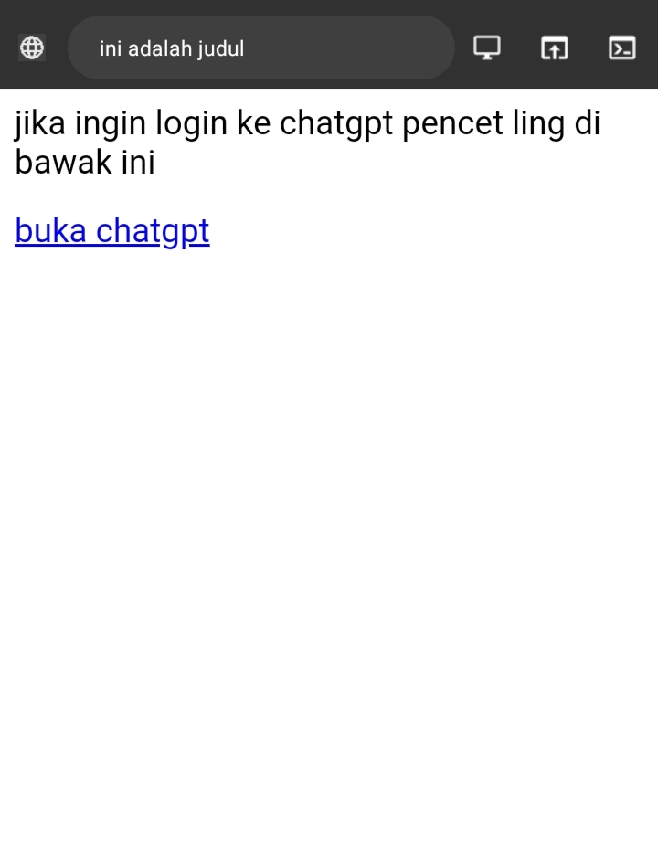
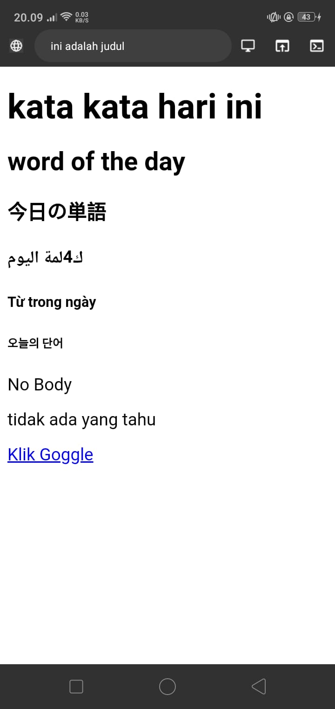
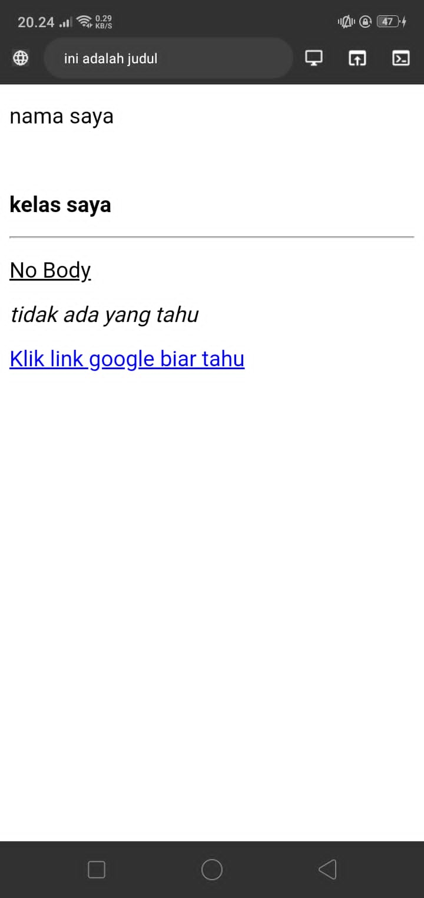
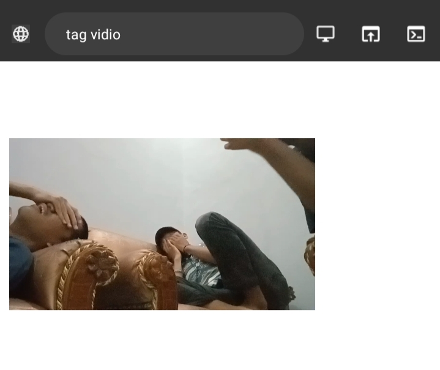
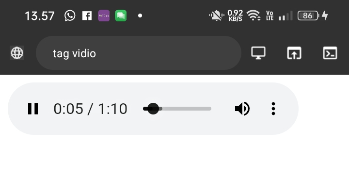
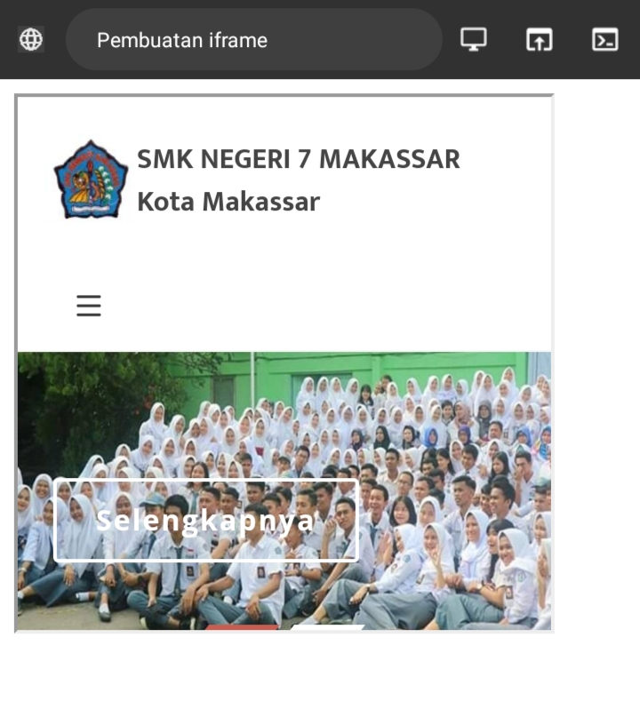

# program
contoh program 
```html
<!DOCTIPE htm>
<html>
  <head>
    <title>ini adalah judul</title>
  </head>
 <body>
<p>jika ingin login ke chatgpt pencet ling di bawak ini</p>
  </body>
</html>
```
hasil program:


penjelasan program:
- tag <!DOCTYPE html> memberitahukan web browser bahwa dokumen `<html>` adalah versi 5
- tag pembuka `<html>` manandai awal sebuah dokumen HTML sampai dengan tag penutup `</html>`
- tag pembuka `<head>` berisi informasi tentang halaman HTLM sampai dengan tag penutup `</head>` biasanya dalam tag head terdapat tag `<title>` untuk memberikan informasi judul halaman HTML
- apapun tag yang berada di antara tag pembuka `<body>` sampai dengan tag penutup `</body>` akan tampil di web browser

# Hyperling html
```html
<!DOCTIPE htm>
<html>
  <head>
    <title>ini adalah judul</title>
  </head>
 <body>
<p>jika ingin login ke chatgpt pencet ling di bawak ini</p>
 <a href="https://www.chatgpt.com">buka chatgpt</a></a>
  </body>
</html>
```
hasil program:

penjelasan program:
- `<a href="https://www.chatgpt.com/">` merupakan tag pembuka.
- `href` merupakan *nama atribut*.
- `"https://www.chatgpt.com/"` merupakan *nilai atribut*.
- ==Login chatgpt== merupakan *nama link*.
- `</a>` merupakan tag penutup
- ada juga tag yang tidak memerlukan tag penutup,contohnya seperti (br).
- `(p)`adalah tag untuk membuat paragraf
- `(b)`adalah tag untuk mempertebal paragraf
- `(u)`adalah tag untuk menggaris bawahi teks
- `(br)`adalah tag untuk membuat garis baru

# heading
```html
<!DOCTYPE
<html>
<h1>kata kata hari ini</h1>
    <h2>word of the day</h2>
    <h3>今日の単語</h3>
    <h4>ك4لمة اليوم</h>
    <h5>Từ trong ngày</h5>
    <h6>오늘의 단어</h6>
    <p>No Body</p>
    <p>tidak ada yang tahu</p>
    <a href="https://www.google.com">Klik Goggle</a>
  </body>
</html>

```

hasil program :
penjelasan hasil program:
Tag `<h1>` Digunakan untuk judul utama atau level judul tertinggi
- Tag `<h2>` Menunjukkan tingkatan judul yang lebih rendah dari `<h1>` atau subjudul
- Tag `<h3>` Menunjukkan tingkatan judul yang lebih rendah atau subjudul dari `<h2>`
- Tag `<h4>` Menunjukkan tingkatan judul yang lebih rendah atau subjudul dari `<h3>`
- Tag `<h5>` Menunjukkan tingkatan judul yang lebih rendah atau subjudul dari `<h4>`
- Tag `<h6>` Menunjukkan tingkatan judul yang lebih rendah atau subjudul dari `<h5>

# program paragraf html
```HTML
<!DOCTYPE>
<head>
    <title>ini adalah judul</title>
  </head>
  
  <body>
    <p>nama saya</p>
    <br>
    <p><b>kelas saya</b></p>
    <hr>
    <p><u>No Body</u></p>
    <p><i>tidak ada yang tahu</i></p>
    <a href="https://www.google.com">Klik Goggle saya biar tahu</a>
  </body>

</html>
```
hasil program:
penjelasan paragraf:
Tag `<p>`digunakan untuk menandai paragraf pada halaman web dan di akhiri `</p>`. Ini memberikan jarak antara paragraf.
- Tag `<b>` digunakan untuk membuat teks menjadi tebal (bold) dan di akhiri `</b>`.
- Tag `<u>` digunakan untuk memberi garis bawah pada teks dan di akhiri `</u>`. 
- Tag `<i>` digunakan untuk membuat teks menjadi miring (italic) dan di akhiri `</i>`.
- Tag `<br>` digunakan untuk membuat jeda baris atau perpindahan ke baris berikutnya tanpa membuat paragraf baru.
- Tag `<hr>` digunakan untuk membuat garis horizontal, yang sering digunakan pemisah visual di antara bagian-bagian pada halaman web.

# tag pembuka dan penutup
Tag pembuka dan tag penutup adalah dua bagian dari suatu elemen dalam HTML yang digunakan untuk menentukan awal dan akhir dari elemen tersebut. Tag pembuka dimulai dengan nama elemen yang diapit oleh tanda kurung sudut ("<" dan ">"). Tag penutup serupa dengan tag pembuka, tetapi memiliki karakter garis miring tambahan ("/") sebelum nama elemennya. contoh ini, `<p>` adalah tag pembuka, dan `</p>` adalah tag penutup

**Atribut tag :
Isi atau konten tag merujuk pada teks, elemen, atau informasi yang ditempatkan di antara tag pembuka dan tag penutup dalam markup HTML. Contoh sederhana adalah tag paragraf `<p>`, di mana isi tag tersebut adalah teks yang ingin dimuat dalam paragraf. Contoh "Ini adalah contoh isi atau konten dalam tag paragraf." adalah isi atau konten yang akan ditampilkan atau diinterpretasikan oleh browser web ketika halaman HTML di-render
# tag list dan multimedia 
## tag list 
dalam html ada sebuah tag yang dapat membantu kita dalam membuat list dengan menggunakan tag `<ul>` dan tag `<ol>` tag ini memiliki fungsi yang sama yaitu membuat list namun memiliki perbedaan yaitu tag `<ul>` atau "unordered list"membuat list yang tidak beraturan, sedangkan `<ol>` atau "ordered list" membuat list yang beraturan. contohnya ialah seperti berikut :
Kode Program :
```html
<!DOCTIPE htm>
<html>
  <head>
    <title>ini adalah judul</title>
  </head>
 <body>
   <p>list nama orang ganteng</p>
<ul>
<li>pak botak</li>
<li>pak kumis</li>
</ul>
  </body>
</html>
```
hasil program 


menambah komentar 
untuk membuat komentar yang tidak dapat di terlihat di browser dan hanya dapat di baca oleh programmer dengan cara <!--tulis komentarmu--> contohnya seperti dibawah ini :
Kode program :
```html
<!DOCTIPE htm>
<html>
  <head>
    <title>ini adalah judul</title>
  </head>
 <body>
   <p>list nama orang ganteng</p>
<ul>
<li>pak botak</li>
<li>pak kumis</li>
</ul>
 <p>ini adalah daftar orang" ganteng
  </body>
</html>
```
hasil program


dengan menuliskan komentar dapat membantu program untuk mengingat hal hal penting dan dapat dituliskan tanpa terbaca di browser.
## multimedia 
untuk html kita dapat menambahkan foto video serta audio dalam vscode untuk dimasukkan di browser caranya ialah seperti berikut :

## menambah foto
untuk menambah foto pada teks editor vscode kita menggunakan tag `` dengan dibantu atribut "src" lalu masukkan lah link foto yang ingin dimasukkan. lalu untuk mengatur tinggi dan lebar dengan atribut tinggi : "height" dan lebar : "weight".
Kode Program :

```html
<!DOCTIPE htm>
<html>
  <head>
 
  </body>
</html>
```
hasil program:


## menambah vidio
```html
<!DOCTYPE html>
<html>
<head>
  <title>tag vidio</title>
</head>
<body>
  <video src="aset/vidio.mp4" controls loop autoplay muted width="250" height="250"></video>
  </body>
  </html>
```
hasil program


# menambah audio​
```html
<!DOCTYPE html>
<html>
<head>
  <title>tag vidio</title>
</head>
<body>
  <audio src="aset/vidio.mp4" controls></audio>
  </body>
  </html>


```
hasil program 


# iframe
Dalam tag `<iframe>` ada beberapa atribut yang penting seperti;
	- `src` untuk mencari halaman html atau web yang akan ditampilkan di dalam frame
	- `width` dan `height` untuk mengatur ukuran panang dan lebar dari frame.
	- Dalam tag `<iframe>` ada beberapa atribut yang penting seperti;
	- `src` untuk mencari halaman html atau web yang akan ditampilkan di dalam frame
	- `width` dan `height` untuk mengatur ukuran panang dan lebar dari frame.
```html
<!DOCTYPE html>
<html>
<head>
    <title>Pembuatan iframe</title>
</head>
<body>
    <iframe src="https://www.smkn7makassar.sch.id/" width="300" height="300"></iframe>
</body>
</html>
```
hasil program


# tabel
Tabel dalam HTML didefinisikan dengan tag `<table>`
	- setiap baris baru tabel dengan tag `<tr>`
	- Header (judul) tabel didefinisikan dengan tag `<th>` Secara default, header tabel memiliki teks tabel dan berada di tengah
	- Data tabel/sel didefinisikan dengan tag `<td>`. Karena sel merupakan bagian terkecil dari tabel maka dari itu tag ini berada di dalam tag `<tr>`.

```html
<!DOCTYPE html>
<html>
<head>
    <title>Table </title>
</head>
<body>
   <table border="3">
    <tr>
        <th rowspan="2">Nama</th>
        <th colspan="2">Asal Institusi</th>
    </tr>
    <tr>
        <th width="200">Sekolah</th>
        <th width="200">Kampus/kerja</th>
    </tr>
    <tr>
        <td height="30">rayhan juli</td>
        <td>smpn 2 Makassar</td>
        <td>Universitas muslim indonesia</td>
    </tr>
    <tr>
        <td height="30">Hayril Abizali</td>
        <td rowspan="2">SMPN 22 Makassar</td>
        <td align="left" rowspan="2">Kerja di umi</td>
    </tr>
    <tr>
        <td height="30">RAHMAT</td>
    </tr>
    <tr>
        <td height="30">Fachri Ramadhan</td>
        <td>MAN 1 Makassar</td>
        <td>kerja pdam</td>
   </table>
</body>
</html>
```
hasil program

penjelasan
tag `<tables>`
tag table berfungsi sebagai pembuka untuk struktur tabel sehingga tabel dapat terbentuk dan tag ini tetap memerlukan bantuan dari beberapa elemen serta atribut.

elemen `<tr>`,`<th>` & `<td>`
- `<tr>`
   untuk elemen `<tr>` digunakan untuk menjadi wadah pengelompokan `<th>` ataupun `<td>`
- `<th>` 
   untuk elemen ini berfungsi sebagai tempat penulisan *field* pada table yang akan digunakan 
- `<td>`
   untuk elemen ini berfungsi sebagai tempat penulisan *record*pada table yang akan digunakan

analisis program
Pada table di atas telah di dibuat table dengan tag `<table>`lalu menggunakan elemen `<tr>` yang berfungsi untuk tempat penulisan setiap baris baru di tabel, setelah itu kita menuliskan tag `<th>` yang berfungsi untuk tempat menuliskan *field* atau judul tabel, dan di akhiri dengan tag `<td>` yang berfungsi sebagai wadah untuk menuliskan *record* atau isi dari tabel dan ditutup kembali dengan tag `</table>`.
