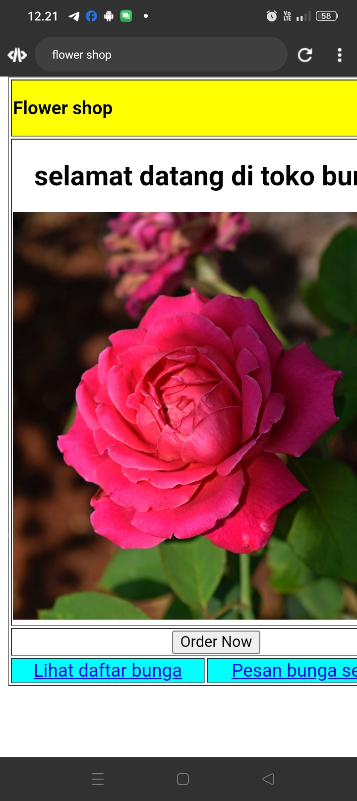
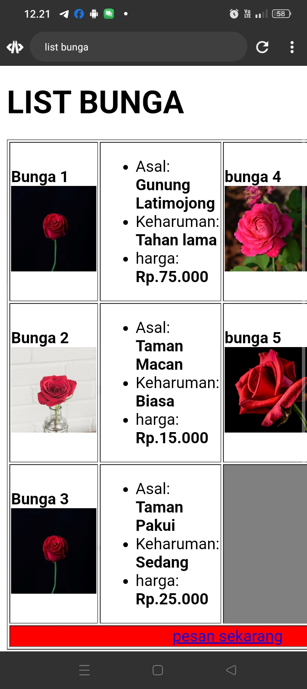
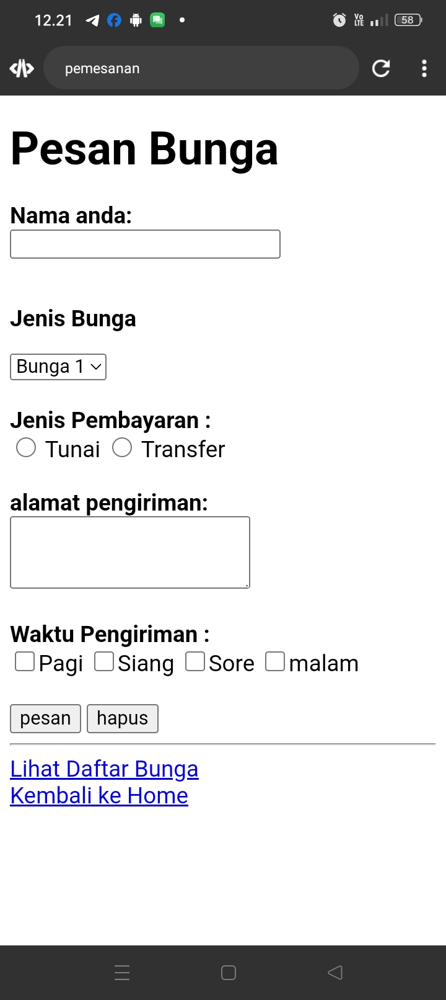

# index.html
```html
<!DOCTYPE html>
<html>

<head>
    <title>flower shop</title>
</head>

<body>
    <table border="1" height="100%" width="100%">
        <tr>
            <th colspan="2" style="background-color: yellow;" align="left">
                <p>Flower shop</p>
            </th>
        </tr
        <tr>
            <th colspan="2">

                <h2 align="center">selamat datang di toko bunga</h2>
                
            </th>
        </tr>
        <tr>
            <td align="center" colspan="2">
                <input type="submit" value="Order Now">
            </td>
        </tr>
        <tr bgcolor="aqua" align="center">
            <td>
                <a href="list bunga.html">Lihat daftar bunga</a>
            </td>
            <td>
                <a href="pesan.html">Pesan bunga segera</a>
            </td>
        </tr>
    </table>
</body>

</html>
```

## analisis program
`<title>flower shop</title>`: Menentukan judul halaman yang akan ditampilkan di tab browser.
- `<body>`: Bagian tubuh dari dokumen HTML yang berisi konten yang akan ditampilkan di halaman web.
- `<table border="0" height="100%" width="100%">`: Membuat sebuah tabel HTML tanpa border dengan tinggi dan lebar 100% dari ukuran layar.
- `<tr>`: Mendefinisikan baris dalam tabel.
- `<th colspan="2" style="background-color: yellow;" align="left">`: Membuat sel header dengan lebar dua kolom yang berisi teks "Flower shop" dengan latar belakang warna kuning dan rata kiri.
- `<h2 align="center">selamat datang di toko bunga</h2>`: Membuat judul level 2 yang berada di tengah halaman dengan teks "selamat datang di toko bunga".
- ``: Menampilkan gambar bunga dengan URL relatif "./GAMBAR/bunga1.jpeg" dengan tinggi dan lebar masing-masing 410 piksel.
- `input type="submit" value="Order Now">`: Membuat tombol submit dengan teks "Order Now".
- `<tr bgcolor="aqua" align="center">`: Membuat baris dengan latar belakang warna biru muda dan rata tengah.
- `<a href="list bunga.html">Lihat daftar bunga</a>`: Membuat tautan untuk menuju halaman "list bunga.html" dengan teks "Lihat daftar bunga".
- `<a href="pesan.html">Pesan bunga segera</a>`: Membuat tautan untuk menuju halaman "pesan.html" dengan teks "Pesan bunga segera".
- `</table>`: Menutup tag tabel.
- `</body>`: Menutup bagian tubuh dokumen HTML.
- `</html>`: Menutup tag HTML dan akhir dari dokumen HTML.

## hasil program


# list bunga
```html
<!DOCTYPE html>
<html>
    <head>
        <title>list bunga</title>
    </head>
    <body>
        <h1>LIST BUNGA</h1>
    <table border="1">
        <tr>
            <td>
                <b>Bunga 1</b><br>
                
            </td>
                <td>
                    <ul>
                        <li>Asal: <b>Gunung Latimojong</b></li>
                        <li>Keharuman: <b>Tahan lama</b></li>
                        <li>harga: <b>Rp.75.000</b></li>
                    </ul>
                </td>
                    <td>
                        <b>bunga 4</b><br>
                        
                    </td>
                     <td>
                        <ul>
                            <li>Asal: <b>Danau taralili </b></li>
                            <li>Keharuman: <b>sedang </b></li>
                            <li>harga: <b>Rp.50.000 </b></li>
                        </ul>
                     </td>
        </tr>
        <tr>
            <td>
                <b>Bunga 2</b><br>
                
            </td>
                <td>
                    <ul>
                        <li>Asal: <b>Taman Macan</b></li>
                        <li>Keharuman: <b>Biasa</b></li>
                        <li>harga: <b>Rp.15.000</b></li>
                    </ul>
                </td>
                    <td>
                        <b>bunga 5</b><br>
                        
                    </td>
                     <td>
                        <ul>
                            <li>Asal: <b>Gunung Bawakaraeng </b></li>
                            <li>Keharuman: <b>Tahan Lama </b></li>
                            <li>harga: <b>Rp.100.000 </b></li>
                        </ul>
                     </td>
        </tr>
        <tr>
            <td>
                <b>Bunga 3</b><br>
                
            </td>
                <td>
                    <ul>
                        <li>Asal: <b>Taman Pakui</b></li>
                        <li>Keharuman: <b>Sedang</b></li>
                        <li>harga: <b>Rp.25.000</b></li>
                    </ul>
                </td>
                     <td colspan="2" align="center" bgcolor="grey">kosong</td>
        </tr>
        <tr>
            <td colspan="4" align="center" bgcolor="red">
                <a href="pesan.html">pesan sekarang</a>
            </td>
        </tr>
      
    </table><br>
    <tr>
        <td>
        <a href="flower shop.html">Kembali Ke Home</a>
        </td>
    </tr>
    </body>
</html>
```
## analisis program
**h1**: Menampilkan judul besar "LIST BUNGA".
- **table, tr, td**: Elemen-elemen ini membentuk struktur tabel. `<table>` mendefinisikan sebuah tabel, `<tr>` mendefinisikan baris dalam tabel, dan `<td>` mendefinisikan sel atau kolom dalam baris tabel.
- **ul, li**: Elemen `<ul>` dan `<li>` digunakan untuk membuat daftar tidak bernomor (unordered list) untuk menampilkan informasi bunga seperti asal, keharuman, dan harga.
- **colspan, align, bgcolor**: Atribut-atribut ini digunakan untuk mengatur penataan dan tampilan sel dalam tabel. `colspan` digunakan untuk menggabungkan beberapa sel menjadi satu kolom, `align` digunakan untuk menentukan penataan horizontal, dan `bgcolor` digunakan untuk menentukan warna latar belakang.
- **a href**: Elemen `<a>` digunakan untuk membuat tautan hyperlink. Atribut `href` menentukan URL atau lokasi halaman yang akan dibuka ketika tautan tersebut diklik.
- **Komplemen**: Terdapat tautan tambahan di bagian bawah untuk kembali ke halaman utama.

## hasil program

## order bunga
```html
<!DOCTYPE html>
<html>
    <head>
        <title>pemesanan</title>
    </head>
    <body>
        <h1>Pesan Bunga</h1>
        <form>
            <label for="nama"><b> Nama anda: </b></label><br>
            <input type="text" nama="nama"><br></br>
            <p><b>Jenis Bunga</b></p>
                <select>
                    <option>Bunga 1</option>
                    <option>Bunga 2</option>
                    <option>Bunga 3</option>
                    <option>Bunga 4</option>
                    <option>Bunga 5</option>
                </select><br></br>
                
                <label><b> Jenis Pembayaran : </b></label><br>   
                <input type="radio"name="jp">
                <label>Tunai </label>
              
                <input type="radio" name="jp">
                <label>Transfer</label><br></br>

                <label><b>alamat pengiriman: </b></label><br>
                <textarea cols="20" rows="3"></textarea><br></br>

                    <label><b>Waktu Pengiriman : </b></label><br>
                    <input type="checkbox"name="waktu"><label>Pagi</label>
                    <input type="checkbox"name="waktu"><label>Siang</label>
                    <input type="checkbox"name="waktu"><label>Sore</label>
                    <input type="checkbox"name="waktu"><label>malam</label><br></br>
              

                    <label>
                        <input type="submit" value="pesan">
                        <input type="reset" value="hapus">
            
                    </label>
        </form>
        <hr>

    
</html>
```
## analisis program
Elemen `<h1>` menampilkan judul besar "Pesan Bunga".
- **form**: Elemen `<form>` digunakan untuk membuat formulir. Formulir ini berisi input dari pengguna yang akan digunakan untuk memesan bunga.
- **label, input**: Elemen `<label>` digunakan untuk menunjukkan label dari input yang terkait, sementara `<input>` digunakan untuk input dari pengguna seperti teks, pilihan radio, atau checkbox.
- **select, option**: Elemen `<select>` dan `<option>` digunakan untuk membuat dropdown list (pilihan dari daftar) untuk memilih jenis bunga yang ingin dipesan.
- **textarea**: Elemen `<textarea>` digunakan untuk membuat area teks besar yang bisa digunakan untuk alamat pengiriman.
- **input type="radio"**: Elemen ini digunakan untuk memilih satu dari beberapa pilihan yang tersedia untuk jenis pembayaran, dengan menggunakan tipe radio button.
- **input type="submit" dan input type="reset"**: Tombol ini digunakan untuk mengirimkan formulir atau menghapus inputan yang telah dimasukkan oleh pengguna.
- **hr**: Elemen `<hr>` digunakan untuk membuat garis horizontal sebagai pemisah.
- **a href**: Elemen ini digunakan untuk membuat tautan hyperlink untuk melihat daftar bunga dan kembali ke halaman utama.
## hasil program
