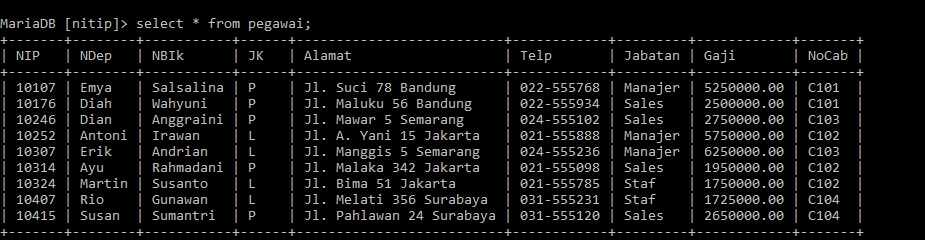

# Tabel Pegawai


# PRAKTIKUM 5
## 17
### Program
```MySql
Select COUNT(NIP) AS JumlahPegawai,SUM(Gaji) AS totalGaji
-> AVG (Gaji) AS RataGaji, Max(Gaji), AS GajiMaks, MIN(Gaji), AS GajiMin 
-> From Pegawai 
``` 
### Penjelasan
- `Select`= untuk memilih kolom mana saja yang dipilih untuk di tampilkan. 
- `COUNT(NIP)` = untuk menghitung jumlah barisan data yang ada pada kolom yang dipilih. 
- `AS JumlahPegawai`= untuk mengganti nama kolom hasil `COUNT(NIP)` menjadi Jumlah `Pegawai`. 
- `SUM(Gaji)`= untuk Menjumlah data yang ada pada kolom yang dipilih. `Gaji` adalah kolom yang dipilih. 
- `AS TotalGaji`= untuk mengganti nama kolom hasil `sum(gaji)` menjadi total `Gaji`. 
- `AVG(Gaji)`= untuk menghitung rata-ratanya suatu data dalam kolom yang dipilih. `Gaji` adalah nama kolom yang dipilih untuk dihitung. 
- `AS RataGaji`= untuk mengganti nama kolom hasil `AVG(Gaji)` menjadi `RataGaji`. 
- `MAX(Gaji)`= untuk menampilkan nilai terbesar dari suatu data dalam kolom yang dipilih `Gaji` adalah nama kolom yang dipilih. 
- `AS Gajimaks`= untuk menampilkan nama dari kolom hasil `MAX(Gaji)` menjadi `Gajimaks` untuk sementara. 
- `MIN(Gaji)`= untuk menampilkan nilai terkecil dari suatu kolom yang dipilih Gaji nama kolom yang dipilih. 
- `AS Gaji min`= untuk mengganti nama dari kolom hasil `min(gaji)` menjadi Gajimin untuk sementara. 
- `From Pegawai`= untuk memilih tabel mana yang dipilih untuk ditampilkan pegawai adalah nama tabel yang dipilih. 
- Hasil Dihitung berapa `NIP`, dijumlahkan semua data pada kolom `Gaji`, Dihitung Rata-Rata dari kolom `Gaji`, Ditampilkan Nilai terbesar pada kolom `Gaji`, dan nilai terkecil dalam kolom `Gaji`. 
### Hasil


## 18
### Program
```Mysql
Select COUNT(NIP) AS JumlahPegawai,SUM(Gaji) AS totalGaji
    -> ,AVG (Gaji) AS RataGaji, Max(Gaji) AS GajiMaks, MIN(Gaji) AS GajiMin
    -> From pegawai
    -> WHERE Jabatan = 'Staf' OR Jabatan = 'Sales'
    -> GROUP BY NoCab HAVING SUM(Gaji) <= 2600000;
```
## Penjelasan
- `Select`= untuk memilih kolom mana saja yang ingin digunakan. 
- `COUNT(NIP)`= untuk menghitung barisan data yang ada pada kolom yang dipilih. 
- `AS JumlahPegawai`= untuk mengganti nama dari kolom hasil `COUNT(NIP)` menjadi jumlah pegawai untuk sementara
- `SUM(Gaji) `= untuk Menjumlah data yang ada pada kolom yang dipilih. Gaji adalah nama kolom yang dipilih
- `AS TotalGaji`= untuk mengganti nama dari kolom hasil `Sum(Gaji)` menjadi `totalGaji` untuk sementara. 
- `AVG(Gaji) `= untuk menghitung Rata-Rata dari kolom yang di pilih. Gaji adalah nama kolom yang di pilih. 
-  `AS Rata_gaji`=  untuk  mengganti nama dari kolom `AVG(Gaji)` menjadi `ratagaji` untuk sementara.  
- `MAX(Gaji)`=  untuk menampilkan nilai terbesar dari suatu data dalam kolom yang dipilih. Gaji adalah nama kolom yang dipilih. 
- `AS Gajimaks`= untuk mengganti nama dari kolom `Max(Gaji)`menjadi `Gajimaks` sementara. 
- `MIN(Gaji)`= untuk menampilkan nilai minimum dari suatu data dalam kolom yang dipilih. Gaji adalah nama kolom yang dipilih. 
- `AS Gajimin`= untuk mengganti nama dari kolom `Min(Gaji)` menjadi `Gajimin` untuk sementara
- `From pegawai`= untuk memilih dari tabel mana yang datanya ingin digunakan Pegawai adalah nama tabel yang dipilih. 
- `Where`= kondisi yang harus dipenuhi oleh suatu kolom 
- `(jabatan = staf OR jabatan = sales)`= Kondisi dari `where`. 
- jadi hanya jabatan staf atau jabatan sales,  hanya salah satunya saja yang harus dipenuhi agar bisa tampil. OR (hanya salah satu kondisi yang harus dipenuhi)
- `GRUP BY`= untuk mengelompokkan data sesuai dengan kolom yang ingin di pilih 
- `Nocab`= nama kolom yang di pilih untuk dikelompokkan
- `HAVING`= kondisi yang harus dipenuhi oleh suatu kelompok data agar bisa di tampilkan
- `(Sum(Gaji)) <= 2.600.000)`= kondisi dari `Having`, hanya data yang hasil jumlah gajinya kurang dari atau sama dengan `2600000` yang bisa tampil
- `Hasilnya`= ada 2 barisan data yang memenuhi kondisi `<= 2600000` Adapun kondisi where yang juga dipenuhi oleh barisan data tersebut. Masing-masing namanya diubah sesuai Perintah `AS`. 
## Hasil 


# PRAKTIKUM 6
## 1
### Program
```Mysql
SELECT NIP, CONCAT(NDep, " ", NBik) AS NamaLengkap
    -> FROM pegawai
    -> WHERE Jabatan ='Sales';
```
### Penjelasan
- `Select`= untuk memilih kolom mana saja yang ingin dipilih untuk ditampilkan/digabung
- `NIP`= Merupakan nama kolom yang dipilih untuk ditampilkan 
- `CONCAT (NDEP,NBLK)`= Menggabungkan beberapa data dalam kolom yang dipilih menjadi satu kolom `(NDEP)`adalah  nama kolom yang dipilih untuk digabungkan datanya `(" ")` Adalah spasi yang diberikan diantara dua kolom yang gabungan yang di pilih.`(data ! Bukan kolom) (NBLK)` adalah nama kolom yang dipilih untuk digabungkan datanya 
- `AS NamaLengkap`= untuk mengganti nama dari kolom hasil `CONCAT(NDEP, " ",NBLK)` menjadi `NamaLengkap` untuk Sementara 
- `FROM pegawai`= untuk memilih dari tabel  mana yang datanya ingin ditampilkan pegawai adalah nama dari tabel yang dipilih
- `WHERE`= Kondisi yang harus dipenuhi oleh suatu data agar bisa ditampilkan
- `(Jabatan = 'Sales')`= kondisi dari where yang harus dipenuhi. Jadi yang barisan data yang Kolom jabatannya berisi Sales, Maka kolom `NIP` dan gabungan kolom : `NDEP` dan `NBLK` akan ditampilkan
- `Hasilnya`= Jadi, kolom yang ingin ditampilkan adalah `NIP dan NDEP, NBLK, NDEP dan NBLK` ingin digabung menggunakan `CONCAT`, Perintah `Concat`Menggabung data tanpa spasi, maka kita harus memasukkan pemisah secara manual yaitu `(" ")` Diantara `NDEP dan NBLK`. Adapun kondisi dari where yaitu hanya barisan data yang kolom jabatannya berisi sales yang bisa ditampilkan kolom NIP dan NDEP, NBLK. Kolom gabungan dari NDEP dan NBLK juga diubah namanya menjadi NamaLengkap, untuk sementara. (" ") Merupakan data yang kita masukkan yaitu spasi, yang bekerja  sebagai pemisah antara NDEP dan NBLK  yang merupakan kolom yang ingin di gabung. 
### Hasil

